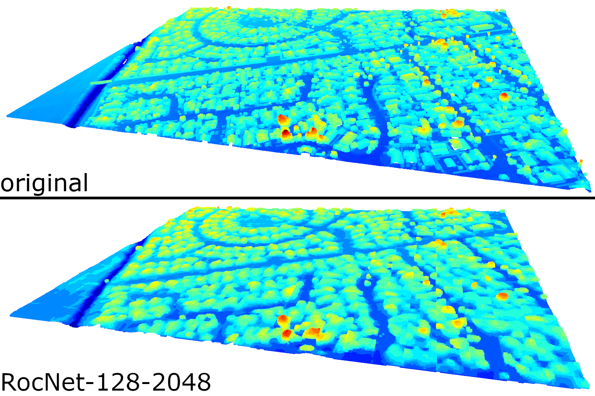

# RocNet Example

An example of how to prepare a RocNet dataset, train a model, and evaluate the accuracy of the model



## Setup

Some prerequisites need specific versions, limited by Open3D and by the python versions supported by the cluster.:

- **Python 3.11**:  
- `open3d==0.18.0`: Was the stable version during RocNet development
- `numpy==1.26.4`: Required for compatibility with Open3d 0.18 (you'll get some fun silent crashes if you use a newer version with Open3D 0.18)
- **Cuda 11.8**: Only required if you want to use the 80GB A100 nodes on the Otago Uni cluster (otherwise use whatever CUDA you want)


### Quickstart

1. Install python 3.11 ([here](https://www.python.org/downloads/))
2. Install CUDA 11.8 ([here](https://developer.nvidia.com/cuda-toolkit-archive))
3. Acquire this repository `git clone --depth 1 https://altitude.otago.ac.nz/rocnet/rocnet-example.git`
4. Run `setup.bat` (windows/cmd) *or* `setup.sh` (linux or windows/git-bash)
5. Download  and extract [example-data.zip](https://share.sjmd.dev/rocnet/example-data.zip) (approx 1.3GB), this is a set of source `.laz` files, a dataset which supports voxel grid resolutions up to 128, and a training run (including model weights) for a model that uses 64-grid inputs. It contains three subfolders:
   1. `laz` - a colletion of `.laz` files
   2. `dataset` - a dataset of tiles created from the `.laz` files
   3. `training` - a training config file, and an example training run with a set of model weights and training progress snapshots

To use the example scripts make sure that the virutal environment from step 3 above is active, and then invoke the train/test/examine scripts like this:

```bash
# Plot loss curve of training run, print some info about the resulting model
python examine_training_run.py ./data/weights/

# Load some tiles from the test dataset, encode/decode them, print compression ratio
# and some meterics of lossiness, and visualise the original and recovered
python test_tile.py ./data/weights

# Load some tiles from the test dataset, encode/decode them, print compression ratio
# and some meterics of lossiness, and visualise the original and recovered
python test_file.py ./data/weights --visualise

# Start a new training run with the configuration in ./data/weights/train.toml
python train.py ./data/weights
```

## General Usage

General usage instructions can be used by invoking a script with `-h` or `--help`, and the process of training a model goes a bit like this:

1. Acquire LIDAR data (e.g. from [opentopography](https://opentopography.org/))
2. (TODO: port tile.py from experiment repo) Run `python tile.py PATH` where PATH is a directory where the tile dataset is created, the script will exit and prompt you to edit the newly created `PATH/tiler.toml`
   1. `input_dir` should point to the folder containing the laz files acquired in step 1
   2. `grid_dim` and `vox_size` should be chosen so that most of the scan fits within the height of `grid_dim` and `vox_size` should be chosen so that continuous surfaces produce continuous 'shells of occupied voxels
   3. Ensure that the relevant transforms are added (especially for smaller `.laz` scans)
   4. `clean` to ensure that the pointclouds are cleaned before tiling
3. Create a dataset of 'tiles' which can be efficiently loaded and used to train a RocNet model
4. Run `python train.py PATH`, which will create `PATH` and `PATH/train.toml` with default values, the script will then exit and prompt you to edit the newly created train.toml, which at a minimum needs
   1. `dataset_path` to point to the dataset folder 
   2. `grid_dim` should be a power of two to 
5. Re-run `python train.py PATH` to start a training run
6. After it's finished, use the `test_*` and `examine_*` scripts to evaluate the result.

## Cluster Training

1. Follow the above setup instructions, but do it on the cluster
2. Modify `slurm-template.sh`:
   1. `SLURM_USERNAME` should be your login username on the cluster
   2. `SLURM_TGT_PARTITION` is the target partition (run `sinfo` on the cluster to get a list of partitions)
   3. `{abs-path-*}` should be absolute paths to the code and to the folder of training runs
3. Modify `train.toml` in the training run folder so that the `dataset` value is an absolute path
4. Run `sbatch slurm-template.sh`, run `squeue --me` and you should see the job listed. If it's running there will be a `R` in the `ST` column, and you should get:
   1. A new training run in the training run folder (a subfolder with the name `train_{TIMESTAMP}`)
   2. A log file in the working directory with the name `slurm-{JOBID}.out`